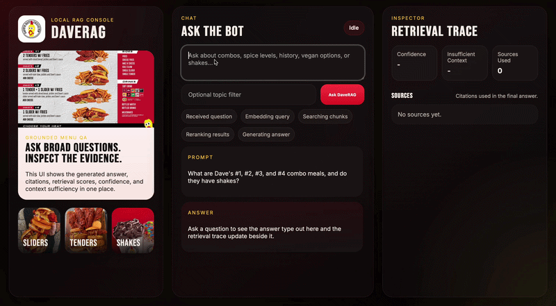

# DaveBot

I built DaveBot because I love Dave's Hot Chicken and wanted to turn that interest into a grounded RAG project instead of a generic chatbot demo. Dave's has a distinct menu, strong brand identity, and a lot of structured facts that make it a good fit for retrieval-based question answering.

## Demo



DaveBot is a RAG chatbot for a structured Dave's Hot Chicken knowledge base. It ingests `dave_data.json`, normalizes each Q/A record, retrieves relevant facts with hybrid search, and answers questions with citations, confidence, and insufficient-context handling through a FastAPI app and local web UI.

## Run Locally

From the project root:

```bash
python3 -m venv .venv
source .venv/bin/activate
pip install -e '.[dev]'
```

Create a `.env` file from `.env.example` and set your OpenAI key if you want OpenAI embeddings/generation:

```bash
OPENAI_API_KEY=your_key_here
EMBEDDING_BACKEND=openai
GENERATION_BACKEND=openai
```

Start the app:

```bash
PYTHONPATH=src uvicorn daverag.api:app --reload
```

Open:

```text
http://127.0.0.1:8000/
```

Optional CLI usage:

```bash
PYTHONPATH=src python3 -m daverag.cli index
PYTHONPATH=src python3 -m daverag.cli ask "Who founded Dave's Hot Chicken?"
```
